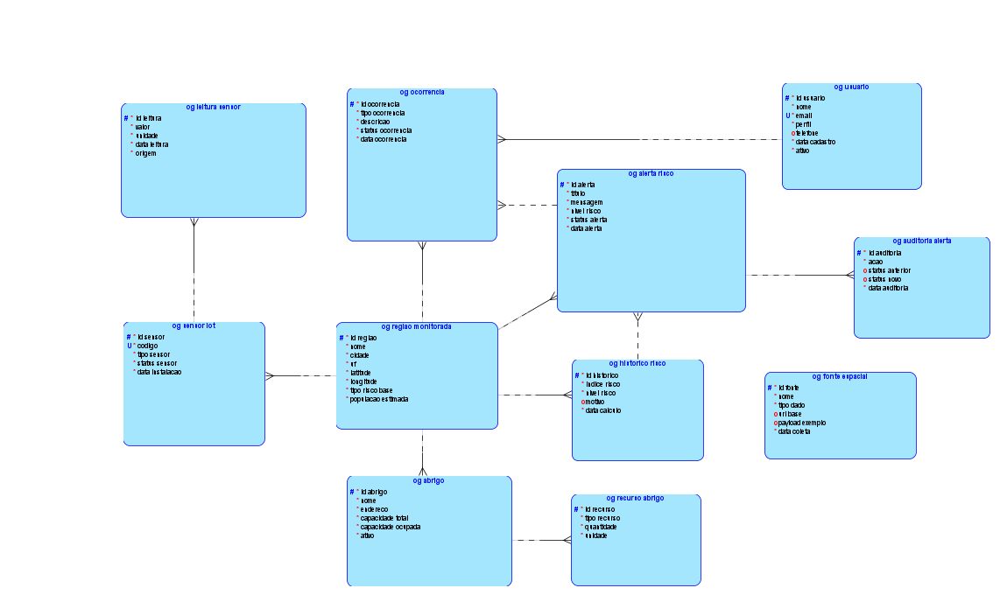
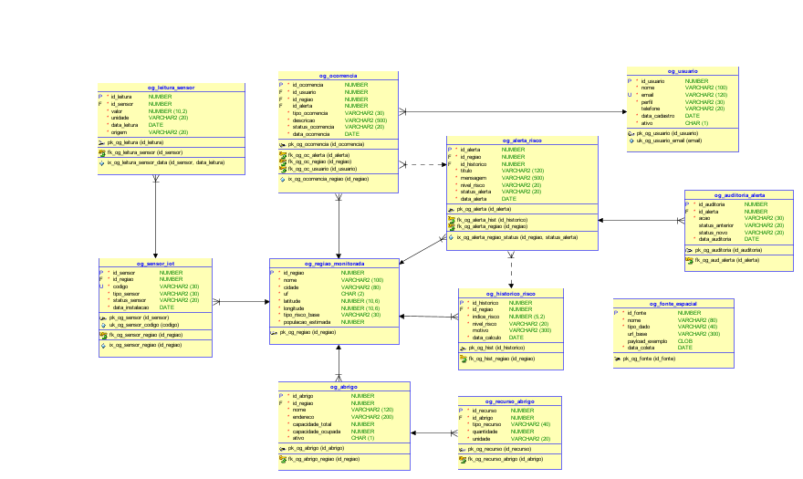

# OrbitGuard API

## Integrantes

* Enzo Monteiro Maciel
* Gabriel Cabral Mendes Mariano
* Matheus de Almeida Sousa

---

# 1. Descrição do Projeto

O OrbitGuard é uma API REST desenvolvida em ASP.NET Core 8 com banco de dados Oracle, criada para auxiliar no monitoramento de riscos ambientais através da integração de sensores IoT, registros históricos, alertas preventivos, ocorrências e gestão de abrigos.

A solução centraliza informações relacionadas a eventos ambientais críticos, permitindo o acompanhamento de regiões monitoradas e o registro de ações preventivas e corretivas.

---

# 2. Objetivo

Desenvolver uma API REST seguindo boas práticas de arquitetura e desenvolvimento, utilizando persistência em banco de dados relacional Oracle, relacionamentos entre entidades e gerenciamento de estrutura através de migrations do Entity Framework Core.

---

# 3. Tecnologias Utilizadas

* ASP.NET Core 8
* C#
* Entity Framework Core 8
* Oracle Database
* Oracle Entity Framework Core Provider
* Swagger
* Swagger Annotations
* OpenAPI
* Visual Studio 2022
* GitHub

---

# 4. Arquitetura do Projeto

O projeto foi desenvolvido utilizando uma arquitetura simples e organizada em camadas.

## Controllers

Responsáveis por receber as requisições HTTP e retornar as respostas da API.

## Entitys

Representam as entidades do banco de dados e suas validações através de Data Annotations.

## Data

Contém o ApplicationDbContext responsável pela comunicação com o Oracle através do Entity Framework Core.

---

# 5. Estrutura do Projeto

```text
OrbitGuardAPI
│
├── Controllers
│   ├── UsuarioController
│   ├── RegiaoController
│   ├── FonteController
│   ├── SensorController
│   ├── LeituraController
│   ├── AbrigoController
│   ├── RecursoAbrigoController
│   ├── HistoricoController
│   ├── AlertaController
│   ├── OcorrenciaController
│   └── AuditoriaAlertaController
│
├── Data
│   └── ApplicationDbContext
│
├── Entitys
│
├── Migrations
│
├── Diagramas
│   ├── OrbitGuard-DBLogical.png
│   └── OrbitGuard-DBRelational.png
│
├── Program.cs
│
└── appsettings.json
```

---

# 6. Banco de Dados

O banco de dados foi modelado utilizando Oracle Database.

A estrutura possui relacionamentos do tipo:

* 1:N
* N:1

atendendo aos requisitos da disciplina.

---

# 6.1 Diagramas do Banco de Dados

## Diagrama Entidade Relacionamento (DER)

O modelo conceitual foi desenvolvido utilizando Oracle Data Modeler, representando as entidades e relacionamentos necessários para o monitoramento de riscos ambientais.



## Modelo Relacional

O modelo relacional apresenta a implementação física do banco Oracle, incluindo tabelas, atributos, chaves primárias, chaves estrangeiras e restrições de integridade.



### Relacionamentos Implementados

* Região → Sensores (1:N)
* Região → Abrigos (1:N)
* Região → Históricos de Risco (1:N)
* Região → Alertas (1:N)
* Região → Ocorrências (1:N)
* Sensor → Leituras (1:N)
* Abrigo → Recursos (1:N)
* Histórico → Alertas (1:N)
* Alerta → Auditorias (1:N)
* Usuário → Ocorrências (1:N)

Todos os relacionamentos foram implementados utilizando chaves estrangeiras (Foreign Keys) e mapeados através do Entity Framework Core.

---

# 7. Entidades da Aplicação

* Usuario
* Regiao
* Fonte
* Sensor
* Leitura
* Abrigo
* RecursoAbrigo
* Historico
* Alerta
* Ocorrencia
* AuditoriaAlerta

---

# 8. Migrations

As migrations são utilizadas para versionar e controlar a estrutura do banco de dados.

## Criação da Migration

```powershell
Add-Migration InitialCreate
```

## Aplicação da Migration

```powershell
Update-Database
```

### Benefícios

* Controle de alterações do banco.
* Histórico de mudanças.
* Facilidade de implantação.
* Sincronização entre ambiente de desenvolvimento e banco Oracle.

---

# 9. Documentação Swagger

A documentação da API foi implementada utilizando:

* Swagger
* Swagger Annotations
* XML Documentation

Através do Swagger é possível:

* Visualizar endpoints.
* Testar requisições.
* Verificar parâmetros.
* Verificar Status Codes.
* Consultar exemplos de retorno.
* Validar relacionamentos da aplicação.

---

# 10. Endpoints Disponíveis

## Usuários

```text
GET    /api/Usuario
GET    /api/Usuario/{id}
POST   /api/Usuario
PUT    /api/Usuario/{id}
DELETE /api/Usuario/{id}
```

## Regiões

```text
GET    /api/Regiao
GET    /api/Regiao/{id}
POST   /api/Regiao
PUT    /api/Regiao/{id}
DELETE /api/Regiao/{id}
```

## Fontes

```text
GET    /api/Fonte
GET    /api/Fonte/{id}
POST   /api/Fonte
PUT    /api/Fonte/{id}
DELETE /api/Fonte/{id}
```

## Sensores

```text
GET    /api/Sensor
GET    /api/Sensor/{id}
POST   /api/Sensor
PUT    /api/Sensor/{id}
DELETE /api/Sensor/{id}
```

## Leituras

```text
GET    /api/Leitura
GET    /api/Leitura/{id}
POST   /api/Leitura
PUT    /api/Leitura/{id}
DELETE /api/Leitura/{id}
```

## Abrigos

```text
GET    /api/Abrigo
GET    /api/Abrigo/{id}
POST   /api/Abrigo
PUT    /api/Abrigo/{id}
DELETE /api/Abrigo/{id}
```

## Recursos de Abrigo

```text
GET    /api/RecursoAbrigo
GET    /api/RecursoAbrigo/{id}
POST   /api/RecursoAbrigo
PUT    /api/RecursoAbrigo/{id}
DELETE /api/RecursoAbrigo/{id}
```

## Históricos

```text
GET    /api/Historico
GET    /api/Historico/{id}
POST   /api/Historico
PUT    /api/Historico/{id}
DELETE /api/Historico/{id}
```

## Alertas

```text
GET    /api/Alerta
GET    /api/Alerta/{id}
POST   /api/Alerta
PUT    /api/Alerta/{id}
DELETE /api/Alerta/{id}
```

## Ocorrências

```text
GET    /api/Ocorrencia
GET    /api/Ocorrencia/{id}
POST   /api/Ocorrencia
PUT    /api/Ocorrencia/{id}
DELETE /api/Ocorrencia/{id}
```

## Auditorias

```text
GET    /api/AuditoriaAlerta
GET    /api/AuditoriaAlerta/{id}
POST   /api/AuditoriaAlerta
PUT    /api/AuditoriaAlerta/{id}
DELETE /api/AuditoriaAlerta/{id}
```

---

# 11. Como Executar o Projeto

## Clonar o Repositório

```bash
git clone URL_DO_REPOSITORIO
```

## Restaurar Dependências

```bash
dotnet restore
```

## Configurar a Connection String

No arquivo appsettings.json configure a conexão Oracle:

```json
{
  "ConnectionStrings": {
    "Oracle": "SUA_CONNECTION_STRING"
  }
}
```

## Criar a Estrutura do Banco

```powershell
Update-Database
```

## Executar a Aplicação

```bash
dotnet run
```

## Acessar o Swagger

```text
https://localhost:PORTA
```

---

# 12. Exemplos de Testes da API

Os exemplos abaixo podem ser utilizados diretamente no Swagger para validar os principais relacionamentos da aplicação.

## Cadastro de Usuário

POST /api/Usuario

```json
{
  "nome": "Gabriel Cabral",
  "email": "gabriel@email.com",
  "perfil": "ADMIN",
  "telefone": "11999999999",
  "ativo": "S"
}
```

## Cadastro de Região

POST /api/Regiao

```json
{
  "nome": "Zona Sul",
  "cidade": "São Paulo",
  "uf": "SP",
  "latitude": -23.550520,
  "longitude": -46.633308,
  "tipoRiscoBase": "ENCHENTE",
  "populacaoEstimada": 500000
}
```

## Cadastro de Fonte Espacial

POST /api/Fonte

```json
{
  "nome": "NASA POWER",
  "tipoDado": "CLIMA",
  "urlBase": "https://power.larc.nasa.gov",
  "payloadExemplo": "{\"temperatura\":28}",
  "dataColeta": "2026-06-02T10:00:00"
}
```

## Cadastro de Sensor

POST /api/Sensor

```json
{
  "idRegiao": 1,
  "codigo": "SENSOR001",
  "tipoSensor": "CHUVA",
  "statusSensor": "ATIVO",
  "dataInstalacao": "2026-06-02T10:00:00"
}
```

## Cadastro de Leitura

POST /api/Leitura

```json
{
  "idSensor": 1,
  "valor": 75.4,
  "unidade": "MM",
  "origem": "IOT",
  "dataLeitura": "2026-06-02T10:15:00"
}
```

## Cadastro de Abrigo

POST /api/Abrigo

```json
{
  "idRegiao": 1,
  "nome": "Abrigo Municipal Central",
  "endereco": "Rua das Flores, 100",
  "capacidadeTotal": 500,
  "capacidadeOcupada": 150,
  "ativo": "S"
}
```

## Cadastro de Recurso de Abrigo

POST /api/RecursoAbrigo

```json
{
  "idAbrigo": 1,
  "tipoRecurso": "AGUA",
  "quantidade": 1000,
  "unidade": "LITROS"
}
```

## Cadastro de Histórico de Risco

POST /api/Historico

```json
{
  "idRegiao": 1,
  "indiceRisco": 85.50,
  "nivelRisco": "ALTO",
  "motivo": "Volume de chuva acima do esperado",
  "dataCalculo": "2026-06-02T11:00:00"
}
```

## Cadastro de Alerta

POST /api/Alerta

```json
{
  "idRegiao": 1,
  "idHistorico": 1,
  "titulo": "Alerta de Enchente",
  "mensagem": "Possibilidade de alagamentos nas próximas horas.",
  "nivelRisco": "ALTO",
  "statusAlerta": "ABERTO",
  "dataAlerta": "2026-06-02T11:30:00"
}
```

## Cadastro de Ocorrência

POST /api/Ocorrencia

```json
{
  "idUsuario": 1,
  "idRegiao": 1,
  "idAlerta": 1,
  "tipoOcorrencia": "ENCHENTE",
  "descricao": "Rua parcialmente alagada.",
  "statusOcorrencia": "ABERTA",
  "dataOcorrencia": "2026-06-02T12:00:00"
}
```

## Cadastro de Auditoria de Alerta

POST /api/AuditoriaAlerta

```json
{
  "idAlerta": 1,
  "acao": "CRIACAO",
  "statusAnterior": "ABERTO",
  "statusNovo": "EM_ANALISE",
  "dataAuditoria": "2026-06-02T12:30:00"
}
```

## Exemplo de Validação de Erro

GET /api/Usuario/99999

Resposta esperada:

```http
404 Not Found
```

```json
{
  "mensagem": "Usuário não encontrado."
}
```

---

# 13. Fluxo de Teste Recomendado

Para validar corretamente todos os relacionamentos da aplicação, recomenda-se executar os cadastros na seguinte ordem:

```text
1. Usuario
2. Regiao
3. Fonte
4. Sensor
5. Leitura
6. Abrigo
7. RecursoAbrigo
8. Historico
9. Alerta
10. Ocorrencia
11. AuditoriaAlerta
```

Dessa forma todas as chaves estrangeiras necessárias estarão disponíveis durante os testes.

---

# 14. Considerações Finais

O OrbitGuard foi desenvolvido seguindo boas práticas de desenvolvimento de APIs REST, utilizando banco de dados Oracle, Entity Framework Core, Swagger e Migrations.

A solução atende aos requisitos técnicos propostos pela disciplina, incluindo:

* Persistência relacional em Oracle.
* Relacionamentos entre entidades.
* Versionamento do banco através de Migrations.
* Documentação completa com Swagger.
* Testes através da interface OpenAPI.
* Organização em camadas.
* Aplicação dos principais Status Codes HTTP.

O projeto demonstra a aplicação prática dos conceitos de desenvolvimento backend utilizando .NET, APIs REST e bancos de dados relacionais.
